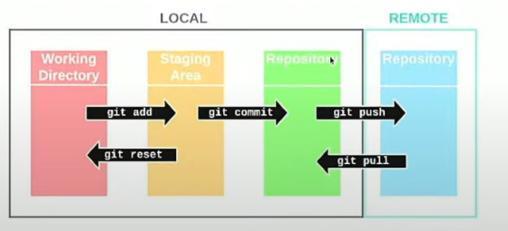

Git areas:
- Working area: directory with an initialised git-project, where the changing of the project files are not yet tracked; 
- Staging area: area with tracked files, where snapshots of the files are added with the command `git add` or removed with `git reset`. This area is needed for preparing a commit;
- Local repository: area where commits are located. All changes to the project files that were added to the staging area will go to the local repository with the command `git commit`
- Remote repository: area in a cloud repository, such as GitHub, Bitbucket, or GitLab. 



```bash
### Check git credentials
git config --global user.name # user.email
### Configure the credentials
git config --global user.name <username_to_add>
```

Force git pull by removing all uncommitted changes (even if staged), and then pull:
```bash
### Remove the uncommitted changes from the staging area
git reset --hard HEAD
git pull

### Remove the untracked files from the Git directory
git stash drop
```
